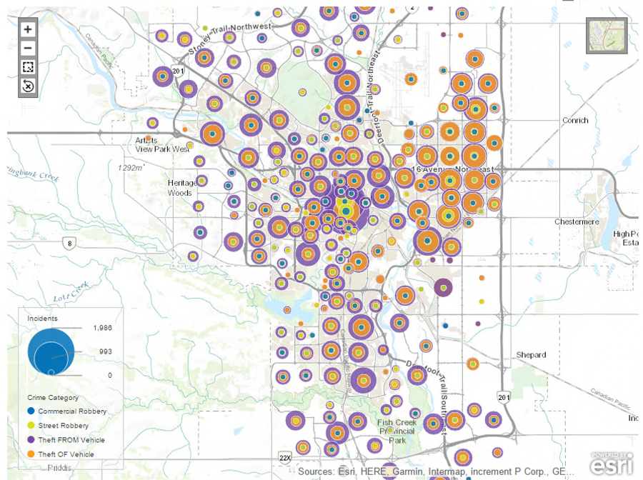

# Geographic Information System (GIS)
Geographic Information System will be used to create visualizations and derive meaningful information by analyzing 4 different datasets which are included in the folder- Data. 

## About Microsoft Excel Pivot Table

Geographic Information System is a framework which is used to create, manage, analyze, and map all types of data where the data is connected to a map along with all the descriptive information by integrating its location data (Esri, 2022). It is a very helpful tool to understand the patterns, relationships, and geographic context in all the industries. This improves the overall management and decision-making capabilities in every industry by considering the patterns shown. It sheds the light on the issues driven mainly by geography. I chose this tool as I was interested to be able to draw actionable insights based on the patterns observed in different geographical locations. Also, this is one of the popular tools which is required by the industries these days as this is easy to use and learn. Following are the key capabilities of this tool (Esri, 2022):

 - Helps to organize, manipulate, and analyze the data to gain actionable intelligence
 - It uses spatial location layers which allows the user to reveal deeper insights into spatial patters by integrating different kinds of data layers
 - It lets the users to evaluate, predict, interpret, and understand more about their data to help in better decision-making
 - By mapping the data well, this map of opioid reveals important geographic patterns
 - Helps in identifying and managing several events based on geography such as pandemic, natural calamity, humanitarian crisis, etc.
 - Helps in identifying patterns to better target certain areas in cases like crimes, natural disaster, pollution, etc.
 - It is useful to understand geographic trends and the changes over the time

## Dataset and Research questions

SAP Lumira Discovery will be used to create visualizations and derive meaningful information by analyzing 4 datasets.

1. Calgary Yearly Crime from 2012 to 2017- This includes 10 crime categories, number of incidents reported in each community for 6 years.

2. Calgary Community Location- This includes the latitude and longitude of each community which is merged (using left join) with the above dataset based on community name to depict the crime categories and the incidents in the form of a map.

3. Calgary Population from 2012 to 2017- This includes the population in each year of each community. This dataset is merged (using inner join to avoid missing values) with Calgary Yearly crime to analyze measure of crime per 1000 for certain years.

4. Calgary Police Service Office Locations- This includes the police office locations in each community to analyze the distribution of offices.

The datasets are imported and combined to perform the analysis. Calgary Yearly Crime does not include the incidents reported for all the crime categories in certain communities which may be due to absence of those crime categories in the respective communities. This data is limited as it only includes the information of few years, and the Calgary Populations dataset contains some missing values, but it is good to analyze the crime rates in Calgary and answer the following research questions.
 - What is the number of crime incidents in each community and how does it change every year?
 - Which areas have the highest incidents reported for thefts and robberies?
 - Does the number of incidents for thefts and robberies increase or decrease with every year?
 - Which crime category is reported the most and the least for each area respectively?
 - What is the measure of crime incidents per 1000 people in 2017?
 - Are the police stations well distributed to respond quickly to high crime areas? Are there any communities which may not be well served?

## Applying the Analytical Tool and Results

##### Question 1: What is the number of crime incidents in each community and how does it change every year?
Following Figure represents the number of incidents in each community where the size is Incidents, Geo Dimension is the community location, and the Animation is the Year. The graph tells that the crime rate is increasing with passing years, especially in Beltline, Downtown Commercial Core & Forest Lawn. These are the areas with highest incidents reported and hence, these are least preferable communities. In 2012 the least number of incidents were reported in Stoney & Livingston whereas in 2017 the least incidents were reported in Livingston and Ogden shop. Overall, Livingston can be the most preferable community.

 

##### Question 2: Which areas have the highest incidents reported for thefts and robberies?
Figure represents the incidents reported for thefts and robberies. Geo Dimension is the community location, size represents the incidents, and the color shows the crime categories (Commercial Robbery, Street Robbery, Theft of Vehicle, and Theft from Vehicle). The graph shows that the theft of vehicle is most common crime, while theft from vehicle is most common in left part of the Calgary map. There are only few cases where theft form vehicle is present while theft of vehicle is not reported for e.g., in Aspen woods, 136 cases if theft from vehicle while none of theft of vehicle. Higher number of incidents are reported of theft from vehicle as compared to theft of vehicle. Also, more incidents are reported of street robbery as compared to commercial robbery.

 

##### Question 3: Does the number of incidents for thefts and robberies increase or decrease with every year?
Figure represents the incidents reported for thefts and robberies in each year. Geo Dimension is the community location, size represents the incidents, color shows the crime categories (Commercial Robbery, Street Robbery, Theft of Vehicle, and Theft from Vehicle) and animation is Year. Only certain crimes categories are reported in certain areas in the beginning i.e., 2012 but as years pass, with the increase in number of incidents, crime categories have also increased in the communities, especially theft of vehicle. Theft from vehicle was more common in the initial years but as years passed more incidents of vehicle thefts were reported. Besides this, street robberies have remained constant over the years while commercial robberies have increased a bit in the later years.

 

##### Question 4: Which crime category is reported the most and the least for each area respectively?
Figure represents the crime categories reported in all the communities in the form of pie to better understand which crime categories are most common in each area. Geo dimension is community location, size is incidents, and color is crime category. Social Disorder is excluded in this case to better understand about the other crime categories as it took most of the pie area. To focus on the areas with highest incidents reported i.e., Beltline and Downtown Commercial Core: Physical Disorder, Theft from Vehicle, Assault, Commercial Break and Enter and are the top crime categories. All the categories are reported in these areas except commercial robbery. In few other areas residential break and enter are also the reported crime categories. Overall, in all the community street robbery has the least incidents reported.

 

##### Question 5: What is the measure of crime incidents per 1000 people in 2017?
In the following map, there are 2 layers, where layer 1 is a pie chart representing Crime per 1000 in 2017 and the color is crime category. Layer 2 is a bubble chart which shows the population of each community through the size of each bubble. Even though in previous charts Beltline seemed to be the community with highest incidents reported, but this graph sheds the light that there are many other communities which has highest crime per 1000 in 2017 which is either equal or surpasses the population of that community. Meadowlark Park is one such example. Even some communities with less population have equivalent number of crimes reported per 1000. Ramsay is one such example. In case of Beltline the population is very high in comparison to the crimes reported per 1000.

 

##### Question 6: Are the police stations well distributed to respond quickly to high crime areas? Are there any communities which may not be well served?
In the following map, there are 2 layers, where layer 1 is a bubble chart representing number of incidents reported and the color shows the crime category except social disorder. Layer 2 is a marker which shows the police offices located in the communities. Even though there are police stations in small gaps and its well distributed but there should be more police stations in the areas with much higher crime rate for the safety of people and in cases of emergency. Such as there should be one in 16 Avenue Northwest which is close to Downtown Commercial core with higher number of incidents reported and higher per capita measure of crimes. Similarly with areas near Sunalta, the service should be available more quickly which requires more police stations in these areas. Also, from the map it seems like Glenmore Trail Southeast is somewhat ignored as there is no police station in this area, which may be due to very few crimes reported.

 

## Analysis and Critique of the Tool

GIS is very easy to learn, and it has been a part of several industries for many years to display information related to natural resources, market analysis, housing, etc. It is a go-to tool if a person needs to analyze different patterns and their respective changes based on geography.

Some advantages of using GIS technology are its ability to integrate the data with the software to analyze, manage, and display all forms of information referenced geographically. It allows the user to add different data layers to reference, compare and analyze various kinds of information through revealing the important trends, patterns, and relationships. It can be integrated into framework of any enterprise information system. Also, it allows many options of depicting the information such as pie, markers, and bubble.

Few limitations of this tool are that there may be some geographic error which may increase with larger scale which might affect the analysis and overall decisions. It provides limited options of improving the visual appearance of the maps in comparison to other visualization tools available such as selecting color palettes, adding labels and texts, etc.

## Conclusion:

Overall, this is a great tool for data analysts who want to visualize their information in the form of maps and want to consider all the communities or areas to depict any kinds of geographical changes. It is easy to use and is compatible on all the electronic devices. It helps in gaining useful and actionable insights on various domains related to geography and helps the analyst in better differentiating the trends in different locations. A user can clearly analyze and look at the trends for each location and take the decisions accordingly for each area. This also helps in setting priorities and targeting certain areas which require immediate attention for important situations such as crime, pandemic, and many more.
